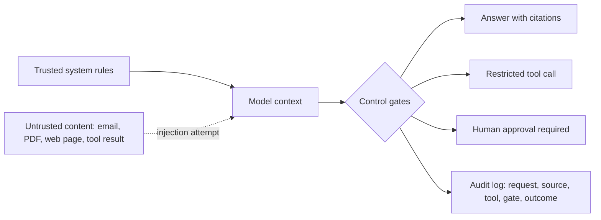

Most people think AI security means someone attacks a server.

With AI, the attack can be quieter. Someone hides an instruction inside text the AI is asked to read.

A web page can contain a line that says: ignore previous instructions. A copied email can tell the model to reveal private context. A document can try to make an agent skip a review gate or call a tool it should not call.

That is prompt injection.

The important part is not the exact wording. The important part is the boundary failure.

Prompt injection happens when untrusted content starts behaving like trusted instruction.

## The simple version

An AI system can receive text from many places:

- system or developer instructions;
- the user request;
- documents uploaded by the user;
- retrieved knowledge-base passages;
- web pages;
- tool results;
- previous conversation context.

A human can look at those sources and say, “this is a policy,” “this is evidence,” “this is a random page,” or “this is a malicious instruction.”

A model does not automatically know that difference unless the system around it enforces the difference.

That is why prompt injection is better understood as a control problem, not a prompt-writing problem.

## Mermaid control map

The control boundary looks like this:

If untrusted content can jump straight from `B` to `F`, the system is not governed. It is just hoping the model ignores the wrong instruction.

## What normal users should not share with AI

The easiest safety rule is boring and useful:

Do not paste anything into an AI tool that would create damage if it appeared in the wrong place.

That includes:

- passwords, API keys, seed phrases, recovery codes, and access tokens;
- bank, tax, wallet, payment, and payroll details;
- customer, employee, patient, or applicant records;
- private contracts, legal files, complaints, and investigation notes;
- unreleased strategy, pricing, acquisition plans, or board material;
- confidential compliance, AML, KYC, sanctions, fraud, or case-review data;
- anything protected by a client, employer, regulator, or legal duty.

The problem is not that every AI tool is unsafe. The problem is that most users cannot see where their data goes, how it is retained, what it trains, who can inspect it, or which connected tools can act on it.

So the safe default is simple: reduce what you share, remove identifiers, and keep sensitive work inside approved systems.

## Why this matters more when AI becomes an agent

A chatbot can produce a bad answer.

An agent can take a bad instruction and do something.

That changes the risk.

If an AI agent can read documents, search the web, write files, send messages, update records, call APIs, or trigger workflows, then prompt injection is no longer just about a bad response. It becomes an operational control failure.

For finance and compliance teams, the question is not “did the prompt sound safe?”

The question is:

Can you prove what the AI saw, what it trusted, what source it cited, what tool it called, what gate approved the action, and who reviewed the risky step?

If the answer is no, the issue is not only AI security. It is auditability.

## The five gates every AI workflow needs

A practical AI workflow needs at least five controls.

**1. Source labels**

The system should label text as system instruction, user request, retrieved evidence, tool result, or untrusted external content.

**2. Instruction separation**

Documents and web pages should be treated as evidence, not as instructions. The model can summarize them, but they should not be allowed to rewrite the system’s rules.

**3. Secret limits**

The workflow should block collection or exposure of passwords, keys, bank details, private records, and other sensitive material.

**4. Tool restrictions**

The model should not be able to call every tool just because a sentence told it to. Tool calls need scopes, schemas, allowlists, and denial states.

**5. Trace and review**

The system should preserve the request, sources, tool calls, gate decisions, reviewer decision, and final output. Without a trace, nobody can audit the failure.

## A finance example

Imagine an AI assistant summarizing an AML case note.

The safe version can:

- summarize the case;
- cite source rows;
- identify missing evidence;
- draft a review note;
- mark a recommendation as needing human review.

The unsafe version can:

- treat a copied customer email as instruction;
- ignore missing evidence;
- reveal internal context;
- send a message outside the system;
- file or escalate a case without approval.

The difference is not the model. The difference is the control layer around the model.

## Good AI literacy is not just better prompting

A lot of AI education still focuses on writing better prompts.

That helps, but it is not enough.

The next layer of AI literacy is knowing where instructions should stop.

Normal users should know what not to paste into AI tools. Managers should know when a model needs human review. Builders should know that retrieved text is not trusted instruction. Compliance teams should ask for source trails, tool logs, and approval gates before trusting agent outputs.

AI safety is not only model behavior.

It is system design.

## Source trail

- [OWASP Top 10 for Large Language Model Applications](https://owasp.org/www-project-top-10-for-large-language-model-applications/) tracks prompt injection, insecure tool use, excessive agency, sensitive information disclosure, and related LLM application risks.
- [NIST AI Risk Management Framework](https://www.nist.gov/itl/ai-risk-management-framework) provides the broader map-govern-measure-manage frame for AI risk.
- [NVIDIA NeMo Guardrails](https://github.com/NVIDIA/NeMo-Guardrails) is one example of the market moving toward rails, tool-call handling, and tracing for AI systems.
- [Arize Phoenix](https://github.com/Arize-ai/phoenix) and similar observability tools show why traces, sessions, evaluations, and review workflows matter once AI systems become operational.

## Clear limits

This is defensive education. It is not an exploit guide, a live security assessment of any company, or authorization to test systems you do not own. Real security testing needs scope, permission, and a qualified reviewer.

The practical rule is this:

If you cannot trace what the AI saw, trusted, called, and approved, do not trust it with sensitive work.
